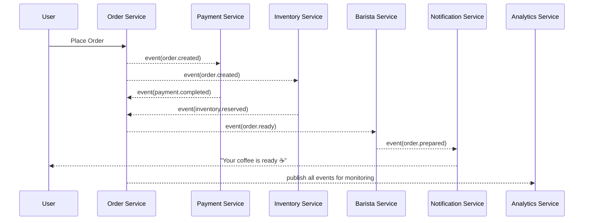

# ☕ Milo Coffee Shop System (Event-Driven Architecture)

**Goal:** Build and evolve a fully event-driven microservice architecture from scratch.  
Each phase focuses on a different architectural concept — from simple message passing to full Saga orchestration and observability.

---

## 🧭 Overview

| Phase                                        | Focus                                       | Status         |
| -------------------------------------------- | ------------------------------------------- | -------------- |
| 🥤 **Phase 1 – Basic Event Flow**            | Simple async communication between services | ✅ In Progress |
| ⚙️ **Phase 2 – Reliability & Ordering**      | Retry, idempotency, DLQ, event versioning   | ☐ Todo         |
| 🔁 **Phase 3 – Saga Pattern (Choreography)** | Distributed transactions with compensation  | ☐ Todo         |
| ☸️ **Phase 4 – Orchestration**               | Central saga coordinator service            | ☐ Todo         |

---

## 🥤 Phase 1 – Basic Event Flow

### 🎯 Objective

Implement a simple coffee shop simulation with asynchronous event communication — no shared DB, no direct service calls.

### 🧩 Services

| Service                | Description                        | Publishes                                | Subscribes                                |
| ---------------------- | ---------------------------------- | ---------------------------------------- | ----------------------------------------- |
| `order-service`        | Creates orders, coordinates states | `order.created`, `order.ready`           | `payment.completed`, `inventory.reserved` |
| `payment-service`      | Handles payments                   | `payment.completed`                      | `order.created`                           |
| `inventory-service`    | Manages stock                      | `inventory.reserved`, `inventory.failed` | `order.created`                           |
| `barista-service`      | Simulates coffee preparation       | `order.prepared`                         | `order.ready`                             |
| `notification-service` | Sends messages to user             | —                                        | `order.prepared`, `order.canceled`        |
| `analytics-service`    | Logs and visualizes event stream   | —                                        | `*`                                       |

---

### 🔄 Event Flow Diagram

